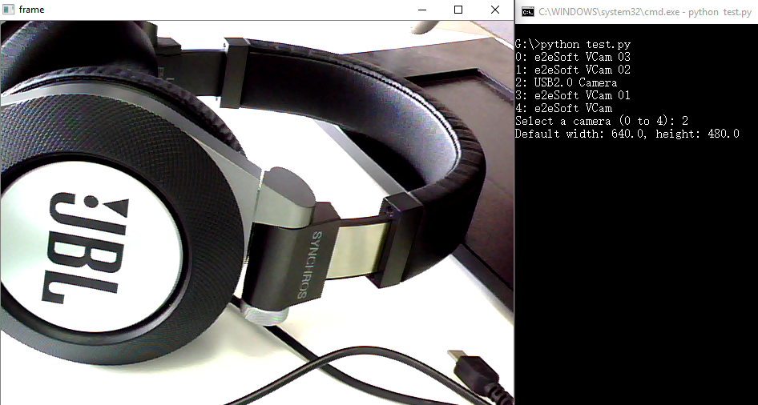

# List Capture Devices for Python OpenCV on Windows
**OpenCV** does not have an API for listing capture devices. The sample shows how to create a Python extension to invoke DirectShow C++ APIs for enumerating capture devices.

## Environment
* [Microsoft Windows SDK][0]
* Python 2.7.9 / Python 3.6.5
* OpenCV 3.3.0

## Environment Working Now
* Python > 3.6
* OpenCV > 3
* Build Tools for Visual Studio 2019 with Windows 10 SDK

## Tips Python Compiler Windows
* Python >=3.5                    --> Visual C++ >=14.X
* Python >=3.3 and <=3.4  --> Visual C++ 10
* Python >=2.6 and <= 3.2 --> Visual C++ 9
* More information [here][3]

## Prepare Environment
1. Install Python 2/3 64 bits
2. Install Opencv >3.0
3. On **CMD**: pip install --upgrade setuptools --> This upgrade the setuptools
4. Microsoft Visual C++ 14.2 standalone: **Build Tools for Visual Studio 2019 (x86, x64, ARM, ARM64)**:
 * This is a standalone version of Visual C++ 14.2 compiler, you don't need to install Visual Studio 2019.
 * Install Microsoft Build Tools for** Visual Studio 2019** [info][2] and Download [here] [4]
 * In Build tools, **install C++ build tools** and ensure the latest versions of MSVCv142 - VS 2019 C++ x64/x86 build tools and Windows 10 SDK are checked.

## How to Run 
1. Configure Visual Studio environment:
    * Visual Studio 2010 (VS10): SET VS90COMNTOOLS=%VS100COMNTOOLS%
    * Visual Studio 2012 (VS11): SET VS90COMNTOOLS=%VS110COMNTOOLS%
    * Visual Studio 2013 (VS12): SET VS90COMNTOOLS=%VS120COMNTOOLS%
    * Visual Studio 2015 (VS14): SET VS90COMNTOOLS=%VS140COMNTOOLS%
	* Visual Studio 2019 (VS16): SET VS90COMNTOOLS=%VS160COMNTOOLS%

    If you are using **Visual Studio 2019**, use the following command:

    ```
    SET VS90COMNTOOLS=%VS160COMNTOOLS%
    ```
	
	Or, search x64 Native Tools Command Prompt for VS 2019 in your menu windows, and don't need use the SET variable before

2. Add your Windows SDK lib path to **setup.py**:

    ```python
    from distutils.core import setup, Extension

    module_device = Extension('device',
                            sources = ['device.cpp'], 
                            library_dirs=['C:\Program Files (x86)\Windows Kits\10\Lib']
                        )

    setup (name = 'WindowsDevices',
            version = '1.0',
            description = 'Get device list with DirectShow',
            ext_modules = [module_device])
    ```

3. Build the Python extension

    Python 2

    ```
    python setup.py build install
    ```

    Python 3

    ```
    python3 setup.py build install
    ```

4. Run the app and select a capture device:

    Python 2

    ```python
    python test.py
    ```

    Python 3
    ```python
    python3 test.py
    ```
    

## Blog
[Listing Multiple Cameras for OpenCV-Python on Windows][1]

[0]:https://en.wikipedia.org/wiki/Microsoft_Windows_SDK
[1]:http://www.codepool.biz/multiple-camera-opencv-python-windows.html
[2]:https://www.visualstudio.com/downloads/#build-tools-for-visual-studio-2019
[3]:https://wiki.python.org/moin/WindowsCompilers
[4]:https://visualstudio.microsoft.com/es/thank-you-downloading-visual-studio/?sku=BuildTools&rel=16
